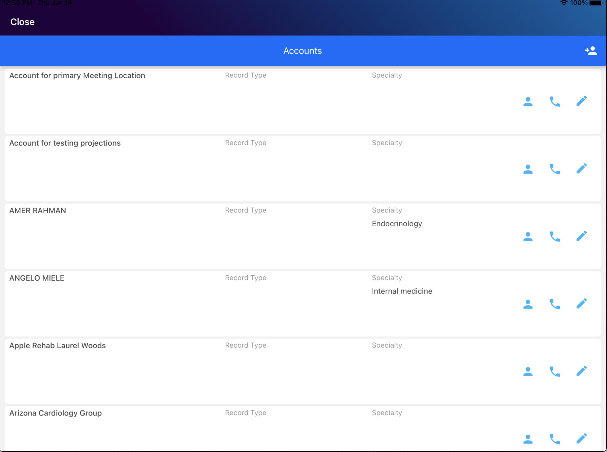
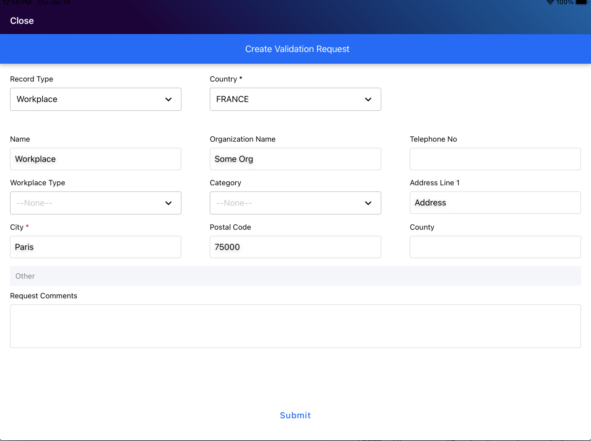

# Onekey Validation Request 

This Validation Request React Native application reads data from the OCE App and allows users to create a Validation Request and save it directly to the Onekey Server. This application has the following screens

List view to list accounts with details
Validation request form
On the validation request page, choose record type "Workplace" or "Activity" based on which the layout to create VR will be updated.  

**Supported device type:** iPad, iPhone

