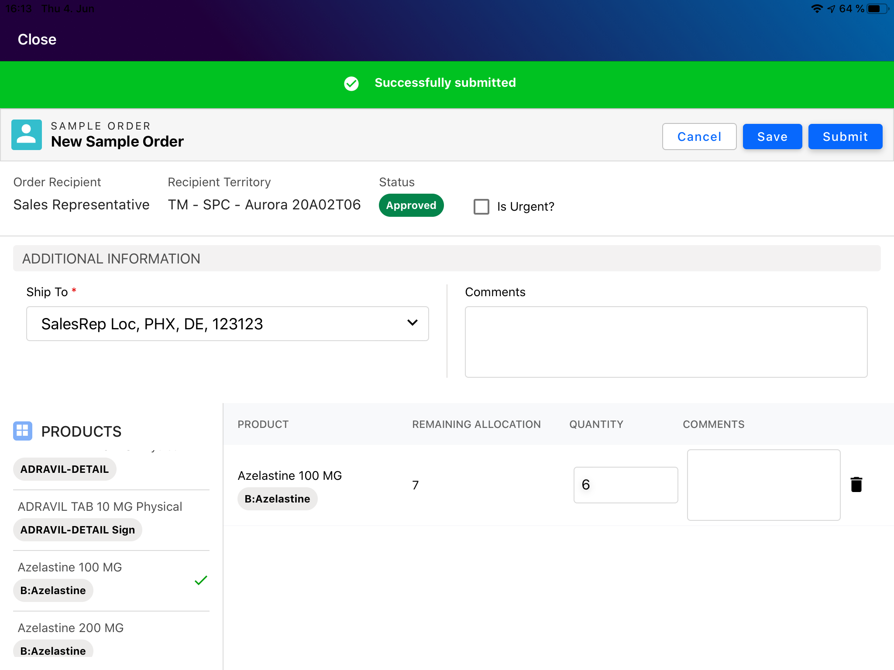
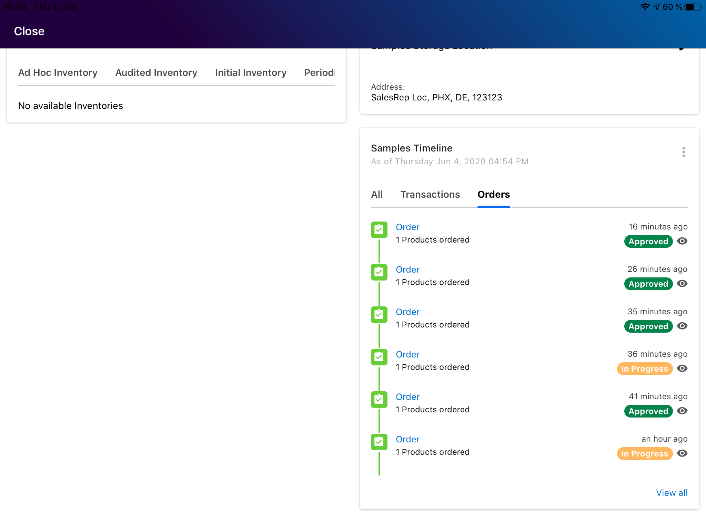
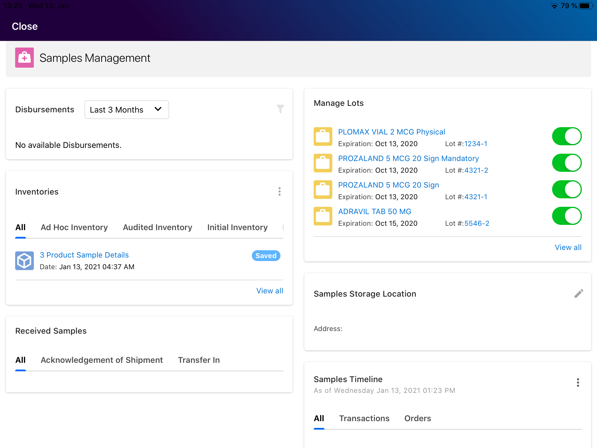
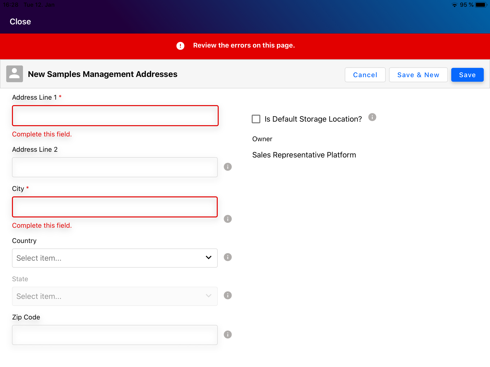
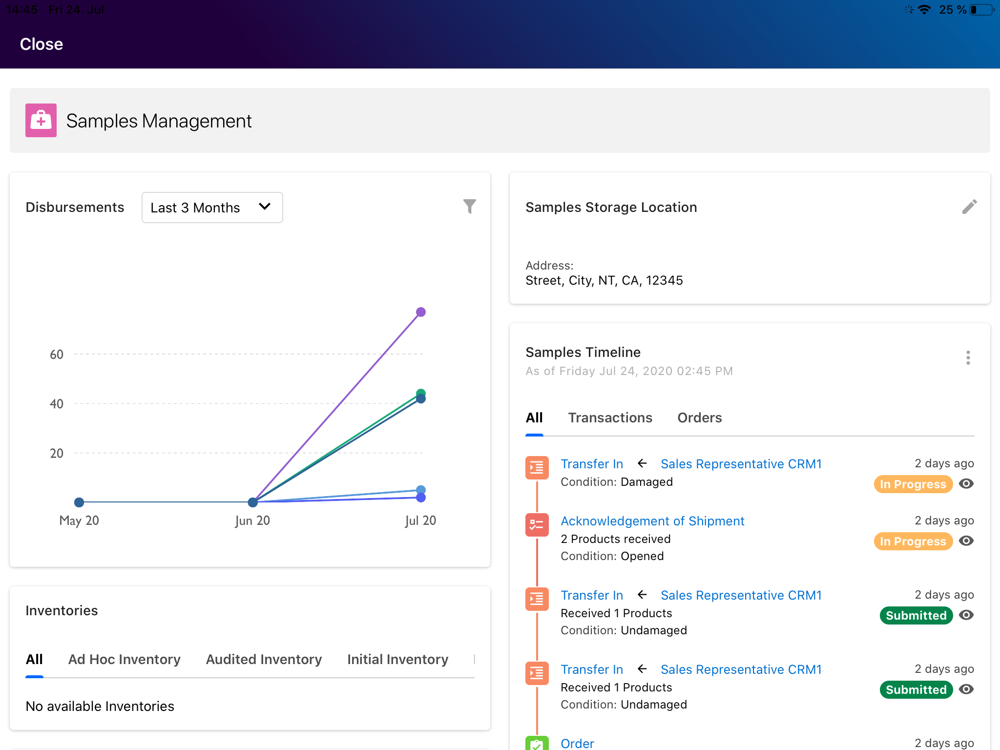

# Sample Management

This React Native app uses Apollo UI constructs and displays the Samples management dashboard. Dashboard consists of 6 widgets:

Inventories
Sample Storage Location
Sample Timeline
Disbursements
Manage Lots
Received Samples
Sample Orders, Sample Transactions, Inventories and New Addresses can be created/previewed/edited directly from the app: these records get created directly in the OCE Salesforce server and any errors are displayed immediately. This is an online app and needs network connection.  

**Supported device type:** iPad

